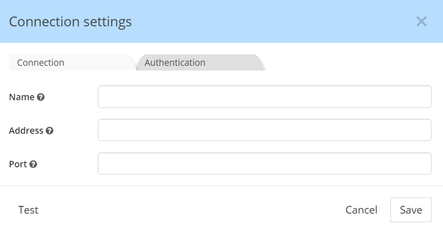

# Hackolade NoSQL DB data modeling plugins

This is the repository for Hackolade plugins.  Plugins let anyone create support so new NoSQL databases can leverage the Hackolade data modeling engine, if they're not already natively supported in Hackolade.  Several plugins have been created by Hackolade for leading NoSQL databases, but you may build your own and have it listed in the DB Target Plugin Manager of the application.

The plugin architecture of Hackolade lets you create your own NoSQL database
‘targets’, respecting its characteristics, through a combination of configuration and custom JavaScript code.  Custom JS code is only necessary for Reverse- and Forward-Engineering.

The process includes 3 main steps:

1. [preparation](#preparation)
2. [plugin creation](#creation)
3. [publication](#publication)

This guide walks you through the steps to create your own plugin in your own GitHub repository. Once you’re ready to make your plugin public, you may create a pull request for your entry in the registry file in this repository.  


## <a name="preparation"></a>1. Overview and preparation

Each NoSQL document database has its own personality: terminology, storage
approach, primary keys, data types, indexing, partitioning/sharding, API, query language, etc...
At Hackolade, after adapting our engine to a couple of rather different NoSQL
vendors, we quickly realized that we were going to have a hard time keeping up
with the frequent appearance of new databases on the market. So, in order to
unleash the power of our data modeling engine, we decided to rewrite the
application and open up our features through a plugin architecture.

With the customization of the properties pane, you're able to control attributes
specific to each DB at the following levels: model, container, entity,
field/attribute, indexing, sharding, etc...

The customization is performed through the configuration of the following modules:

1.  [localization](#prepLocalization)
2.  [data types](#prepTypes)
3.  [properties panes](#prepPanes)
4.  [connection and authentication](#prepConnection) parameters
5.  [reverse-engineering](#prepRE) parameters for document sampling and schema inference
6.  [forward-engineering](#prepFE) if the target DB supports it (TBA) 

 
### <a name="prepLocalization"></a>1.1 Hierarchy and localization
You first need to carefully define the hierarchy for the database, and its related terminology. Consider some differences between the MongoDB and the Couchbase hierarchies, for example:


<br>

### <a name="prepTypes"></a>1.2 Data types
Next, you need to define data types.  Many databases simply support the standard JSON data types.  Others have additional data types with special behaviors.  


You may specify the order in which the data types appear.
<br>

### <a name="prepPanes"></a>1.3 Properties pane
Each data type can inherit default properties and constraints from the standard
Hackolade configurations.  But you may want to create additional properties and constraints for some data types.  To define these properties and controls, you may choose among different controls:


The same controls can be used to define information in different properties panes and lower tabs, for example for indexing, sharding, etc..
<br>


### <a name="prepConnection">1.4 Connection and authentication parameters
In order for reverse-engineering to be performed, it is first necessary to connect to the database.  You need to define the protocol, connection parameters, and authentication parameters.

<br>


### <a name="prepRE"></a>1.5 Reverse-engineering
For Reverse-Engineer to be performed, it is required to write custom JavaScript code.  
This code will connect to the database according to the connection parameters defined above.  It will also invoke queries to discover the database objects so the user can select what needs to be reverse-engineered. Finally, the code will query the database to obtain a sample and pass it on to Hackolade's engine for schema inference.
<br>


### <a name="prepFE"></a>1.6 Forward-engineering (TBA)

<br>
<br>

## <a name="creation"></a>2. Plugin creation

The easiest way to create a new plugin is to copy an existing one as a starting
point, and to edit it progressively, verifying along the way that the desired
behavior gets reflected in the application. When choosing an existing plugin,
make sure to take one with a storage model as close as possible to yours.

It is **strongly** suggested to operate carefully, progressing with small steps, and testing very frequently.  The application requires to be restarted to load the plugin configuration modifications.  If the plugin does not appear in the target selection dialog when creating a new a model, that's generally a sign that there are JSON syntax errors or conflicts.

Plugins are stored in the **%userprofile%/.hackolade/plugins** directory. The plugin folder name must be the same as the **name** property in package.json file of your
plugin.

The creation process follows these steps:

1. [package.json file](#creaPackage)
2. [logo file](#creaLogo)
3. [localization file](#creaLocalization)
4. [data types](#creaTypes)
5. [properties panes](#creaPanes)
6. [input controls](#creaControls)
7. [reverse-engineering](#creaRE) 
8. [forward-engineering](#creaFE) 


### <a name="creaPackage"></a>2.1 package.json
The **package.json** file is the plugin entry point. This file is required and
contains initial info about plugin such as name, version, author, target name
etc.. It must remain in the root of your plugin folder. 

The mapping below shows how the information is used throughout the application.


**name** *(string)* - required; unique plugin name

**version** *(string)* - required; used to compare versions and provide
possibility to update plugin

**versionDate** *(string)* - optional; for internal use only

**author** *(string)* - required; defines plugin author

**engines** *(object)* - required; used to define the lowest Hackolade version
supporting this plugin

Example:

	"engines": {
    	"hackolade": "1.9.x",
    	}

**contributes** *(object)* - required; provides information about the database
target and available features

Example:

	"contributes": {
    	"target": {
    	    "applicationTarget": "ELASTICSEARCH",
    	    "title": "Elasticsearch",
    	    "versions": [
    	        "v6.0"
    	    ]
    	},
    	"features": {
    	    "nestedCollections": true
    	}
	}

 

**target** *(object) -* provides information about target name for which the
plugin was created; applicationTarget value must be uppercase

**features** *(object)* - optional; object which defines what features will be
enabled or disabled; Key is the name of feature. Value - true or false;

Available features:

-   nestedCollections *(boolean)* - optional: if true, enables parent-child entities [default: false]
-	disablePatternField *(boolean)* - optional: if false, disables the ability to define attributes as pattern fields [default: false]
-   disableMultipleTypes *(boolean)* - optional; if true, disables the ability to define multiple types for a field [default: false],
-   jaySchemaHasRequiredPatternField *(boolean)* - optional; if true, enables the ability to set up required to pattern fields [default: false]
-   enableReverseEngineering *(boolean)* - optional; if true, enables the reverse-engineering [default: false]
-   enableForwardEngineering *(boolean)* - optional; if true, enables the forward-engineering [default: false]
-   forwardEngineering *(object)* - optional; contains parameters related to forward engineering, for details see [Forward-Engineering Feature](#forward-engineering-feature)


**description** - optional; this data will be displayed in the list of plugins

**disabled** - optional; used to mark the plugin as disabled [default: false]


#### <a name="forward-engineering-feature"></a>2.1.1 Forward-Engineering Feature

Forward-Engineering feature allows to define types into the JSON Schema and has next structure:

```
{
    'jsonSchema': {
        'keepParentType': <...>
    }
}
```

**keepParentType** *(boolean|object)* - if true, fields in the JSON Schema after forward-engineering will have base types instead of inherited. An object also is determined as a true and has possibility to re-define types in the JSON Schema. For this, necessary to define an object where keys are names of types and a value can be as a name so and a description of the other type. The description contains property that related to field. For example:

```
{
    'jsonSchema': {
        'keepParentType': {
            "objectId": {
                "type": "string",
                "pattern": "^[a-fA-F0-9]{24}$"
            },
            "regex": "string"
        }
    }
}
```


### <a name="creaLogo"></a>2.2 Logo file
**logo.jpg** - the plugin logo image to be displayed in the list of plugins. Name and extension of the file cannot be changed. The file is placed in the root folder next to the package.json file. If not set - the first letter from **name** property in package.json file will be used instead of a logo.

 


### <a name="creaLocalization"></a>2.3 Localization

The localization folder contains files for language / target localization of the target database. Language localization can be implemented by creating **\*.json**
files inside **localization** folder. File name for localization should
correspond to ISO naming convention (e.g. **en** for English localization)


Each localized item inside **\*.json** file is represented by a key/value pair
e.g.:


	"MAIN_MENU___ADD_COLLECTION": "Add Collection"
 
If you delete any predefined property from this file - default text will be
displayed.

 

### <a name="creaTypes"></a>2.4 Base data types

There are 7 base types in Hackolade:

1.  String
2.  Boolean
3.  Numeric
4.  Document
5.  Array
6.  Binary
7.  Null

If you don’t need to change name and behavior of basic types - you can skip this configuration block. If you want to customize basic type or create a custom type - you can create your own configuration. The only condition is that new type must be INHERITED from the basic types above.

For example in order to create custom type \<list\> using the \<array\> type as a basis, it is necessary to perform the following steps:


a.  Create list.json file inside **types** sub-folder of the plugin folder (notice that file name should be the same as type name)

b.  Edit list.json to set the name, parent type (one out of list of 7 base types) and abbreviations for your custom type in the properties object inside list.json file:

 

	{
    	"name": "list",
    	"erdAbbreviation": "<list>",
    	"dtdAbbreviation": "[...]",
    	"parentType": "array"
	}


Some data datatypes have many subtypes.  For example a numeric datatype may allow: integer, smallint, bigint, float, double, etc...  In such case, we advise to only define one datatype (numeric) and put the subtypes in a dropdown mode. 
 
The syntax works as follows:
**name** *(string)* - required; type name

**erdAbbreviation** *(string)* - optional; abbreviation that is used to display
in the ERD table

**dtdAbbreviation** *(string)* - optional; abbreviation used to define field
visually on DTD

**parentType** *(string)* - optional; one out of 7 base types (used if custom
type should be created)

**sample** *(string)* - optional; value that is used to display in the
corresponding input in Property Pane by default

**useSample** *(boolean)* - optional; defines whether to use default value for
sample or not

**mode** *(array)* - required for numeric fields; there are 4 base modes for
numeric types:

-   integer32
-   integer64
-   decimal128
-   double

It is possible to define own mode with custom name that inherits base mode
behaviour (esp. validation). For example here’s how a new mode **int** will be
created:

	{
    	"name": "int"
    	"parentType": "integer32",
    	"sample": 12
	}


**defaultValues** *(array)* - optional; used to define properties in PP; can be
different and custom for each type

**default** *(boolean)* - optional; used to define the main type if exists more than one data type with the same parent type 
 
**relatedTo** *(array)* - optional; used to define types to which can be created a relationship


### <a name="creaPanes"></a>2.5 Properties pane structure
There are multiple levels in the Hackolade hierarchy:

1.  model: each Hackolade file represents one model for a given DB target
2.  container: a database, a namespace, a bucket, a keyspace, or a region
3.  entity: a collection, a table, an index
4.  field: an attribute
5.  view (if applicable)

The properties pane can be configured for each level.  And each level can have multiple properties pane tabs.

#### 2.5.1 Hierarchy
All configurations are stored in the **properties_pane** sub-folder of the plugin folder. Each level has its own sub-folder with corresponding naming:

-   **model_level**
-   **container_level**
-   **entity_level**
-   **field_level**
-   **view_level**

Inside each folder there’s a **[LEVELNAME]LevelConfig.json** file which contains configurations for its properties pane tabs.


You can add **defaultData.json** file to a **properties_pane** folder to define
default values to be displayed in the properties pane. 

#### 2.5.2 Lower tab properties pane
Each **\*.json** file represents an array with objects. Each object has
configurations for a particular tab. Tab name is defined in **lowerTab** property.
All properties are defined as an array and have the same structure across all properties pane configurations. Here’s an example of details tab with one property **comments:**


	[
    	{
        	"lowerTab": "Details",
        	"structure": [
            	{
                	"propertyName": "Comments",
                	"propertyKeyword": "comments",
                	"shouldValidate": false,
                	"propertyTooltip": "comments",
                	"propertyType": "details",
                	"template": "textarea",
                	"valueType": "string"
            	}
        	]
    	}
	]


**lowerTab** is used to define the lower tab for the hierarchical level, such as details, indexes, sharding, etc...


**structure** property represents a collection of objects, each describing field
type and behavior.


#### 2.5.3. Container Level Keys
Container Level Keys - fields which are the keys at the container level and automatically added to entities when they are created. They are defining at **containerLevelConfig** by property **containerLevelKeys**. For example:

	{
    	"containerLevelKeys": [...],
    	"structure": [...],
    	"lowerTab": "..."
	}

Setting container level keys has the similar structure to [Property controls](#creaControls). For example key with name "Index":

	{
    	"containerLevelKeys": [{
    	    "labelName": "Index",
    	    "defaultName": "_index",
    	    "propertyPrimaryKey": true,
    	    "typeName": "Data type",
    	    "typeOptions": ["string"],
    	    "defaultType": "string",
    	    "disabledFieldOption": true,
    	    "sampleGen": "&containerName",
    	    "propertyName": "Index",
    	    "propertyKeyword": "index",
    	    "propertyType": "text"
    	}]
	}

**labelName** *(string)* - required; name of property in properties pane

**propertyPrimaryKey** *(boolean)* - required; whether the field is a primary key

**typeName** *(string)* - required; label name of selector type

**typeOptions** *(array)* - required; variant of types for field

**defaultType** *(string)* - optional; default field type

**defaultName** *(string)* - optional; default name of field

**sampleGen** *(string)* - optional; generate sample for field in preview, can contains next variants:

 1. *&random* - will generate random value
 2. *&entityName* - link to entity name
 3. *&containerName* - link to container name
 4. *constant* - some constant value

**disabledFieldOption** *(boolean)* - optional; disable options of field

 


### <a name="creaControls"></a>2.6 Property controls

Different input controls can be defined for each property:

1. simple text
2. text area (pop-up text)
3. dropdown selection
4. numeric
5. checkbox (boolean)
6. properties group
7. field list
8. field list with dropdown of attributes

Each control is further described below.  The control is defined using the following syntax:  
**propertyName** *(string)* - required; used to display label in the Properties
Panes for a property.

**propertyKeyword** *(string)* - required; used in the main code as a keyword; no
whitespaces are allowed.

**propertyType** *(string)* - required; field types; possible values are:

1. simple text: [text](#text)
2. text area (pop-up text): [details](#details)
3. dropdown selection: [select](#select)
4. numeric: [numeric](#numeric)
5. checkbox (boolean): [checkbox](#checkbox)
6. properties group: [group](#group)
7. field list: [tagInput](#tagInput)

**template** *(string)* - optional; template used in the modal window if propertyType is details; possible value is: 
details: textarea, or
tagInput: collectiontree

**options** *(array)* - optional; used to define options in the select input if
propertyType is select.

**propertyTooltip** *(string)* - optional; only taken into account for propertyTypes: text area,  dropdown, properties group, and field list

**valueType** *(string)* - optional; type (one out of 7 basic types) to define
validation rules.

**shouldValidate** *(string)* - optional; defines whether field should be validated or any value is allowed.  Validation rules are defined in validationRegularExpressions.json;

**dependency** *(object)* - optional; define dependence on value other properties. It has next format: 
```
{ 
    "key": <inputKeyword of the dependent field>, 
    "value": <value of the dependent field> 
}
``` 

**disabledOnCondition** *(array)* - optional; used to disable property if all of statements in array are true. The array contains objects that structure similar to *dependency*

For your properties, you may choose among a number of input controls:

#### <a name="text"></a>2.6.1. simple text


	{
		"propertyName": "Simple text",
		"propertyKeyword": "simpletextProp",
		"propertyType": "text",
	}


#### <a name="details"></a>2.6.2. text area (pop-up box)
Used to add a description or comments with defined template property


	{
		"propertyName": "Text area",
		"propertyKeyword": "textareaProp",
		"propertyTooltip": "Popup for multi-line text entry",
		"propertyType": "details",
		"template": "textarea"
	}


#### <a name="select"></a>2.6.3. dropdown selection


	{
		"propertyName": "Dropdown selection",
		"propertyKeyword": "dropdownProp",
		"shouldValidate": false,
		"propertyTooltip": "Select from list of options",
		"propertyType": "select",
		"options": [
			"Option 1",
			"Option 2",
			"Option 3",
			"Option 4"
		]
	}

#### <a name="numeric"></a>2.6.4. numeric


	{
		"propertyName": "Numeric",
		"propertyKeyword": "numericProp",
		"propertyType": "numeric",
		"valueType": "number",
		"allowNegative": false,
		"propertyValidate": true
	},


#### <a name="checkbox"></a>2.6.5. checkbox (boolean)


	{
		"propertyName": "Checkbox",
		"propertyKeyword": "checkboxProp",
		"propertyType": "checkbox"
	},


#### <a name="group"></a>2.6.6. properties group


	{
		"propertyName": "Group",
		"propertyType": "group",
		"propertyKeyword": "grpProp",
		"propertyTooltip": "",
		"structure": [
			{
				"propertyName": "Simple Grp Text",
				"propertyKeyword": "simpleGrpText",
				"propertyType": "text"
			},
			{
				"propertyName": "Group Number",
				"propertyKeyword": "grpNumber",
				"propertyValidate": true,
				"propertyType": "numeric",
				"valueType": "number",
				"allowNegative": false
			}
		]
	}


#### <a name="tagInput"></a>2.6.7. field list


	{
		"propertyName": "Field List",
		"propertyKeyword": "keyList",
		"propertyType": "tagInput",
		"template": "collectiontree"
	}


#### 2.6.8. field list with dropdown of attributes


	{
		"propertyName": "Field List w/ dropdown",
		"propertyKeyword": "keyListOrder",
		"propertyType": "tagInput",
		"template": "collectiontree",
		"types": [
			"ascending",
			"descending"
		]
	} 
<br> 

### <a name="creaRE"></a>2.7 Reverse-Engineering

All configurations for Reverse Engineering are stored in folder **reverse_engineering**. 

The reverse-engineering structure is represented by several blocks and include:

-   [configuration](#connectConfig) for connection settings modal and authentication
-   [API program](#APIprogram) to access the DB and perform reverse-engineering
-   [error messages](#errMessages)
-   package file with npm modules [dependencies](#dependencies)


#### <a name="connectConfig"></a>2.7.1 Connection parameters and authentication
Connection and authentication params and connection settings modal configuration are defining in the **connectionSettingsModalConfig.json** file.

	[
    	{
    	    "lowerTab": "Connection",
    	    "structure": [
    	        {
    	            "inputLabel": "Disable SSl Authentication",
    	            "inputKeyword": "disableSSL",
    	            "inputType": "checkbox",
    	            "inputTooltip": "Disable SSl Authentication for local instance"
    	        }
    	    ]
    	}
	]


This config contain a list of templates (tabs) for different part of connection settings split by categories and has the next structure:

**lowerTab** *(string)* - required; tab name in connection settings modal

**structure** *(array)* - required; list of inputs for connection settings modal

**inputLabel** *(string)* - required; connection settings input label

**inputKeyword** *(string)* - required; keyword for connection settings param which is used in the RE process

**inputType** *(string)* - required; type of connection settings input. Available input types to use when customizing connection settings template are:

-   text
-   checkbox
-   password
-   select
-   numeric
-   dynamicListInput
-   file

**inputTooltip** *(string)* - optional; connection settings input tooltip message

**inputPlaceholder** *(string)* - optional; placeholder for connection settings input

**isHiddenKey** *(string)* - optional; flag that defines values which would be replaced by ****** in the log file

**defaultValue** *(string)* - optional; default value for connection settings param

**options** *(array)* - optional; an array of objects that defines list of options for *select* input. An object has next fromat: 
```
{ 
    "value": <value of option>, 
    "label": <view of option> 
}
```

**dependency** *(object)* - optional; define dependence on value other properties. It has next format: 
```
{ 
    "key": <inputKeyword of the dependent field>, 
    "value": <value of the dependent field> 
}
``` 
**extensions** *(array)* - optional; an array of strings that defines extensions of chosen files for *file* input

**modalTitle** *(string)* - optional; defines title of modal window for *dynamicListInput*

**modalInputs** *(array)* - optional; an array that contains a description of fields inside modal window of *dynamicListInput* similar to structure of [property controls](#creaControls)

#### <a name="APIprogram"></a>2.7.2 Programming of Reverse-Engineering 
The file **api.js** is an adapter between the Hackolade application and the target database that allows you to perform reverse-engineering and process data using the API methods:

-   [connect()](#reConnect)
-   [disconnect()](#reDisconnect)
-   [testConnection()](#reTestConnection)
-   [getDatabases()](#reGetDatabases)
-   [getDocumentKinds()](#reGetDocumentKinds)
-   [getDbCollectionsNames()](#reGetDbCollectionNames)
-   [getDbCollectionsData()](#reGetDbCollectionsData)

Full sequence of the reverse-engineering process next: <br> 
`connect() -> getDatabases() -> getDocumentKinds() -> getDbCollectionsNames() -> getDbCollectionsData()`

The first step after connect is able to change with property *scenario* from config.

Every methods receive three parameters:

-   **data** *(object)* - some data from application
-   **logger** *(object)* - contains method *log()* that used to write information about process of the Reverse-Engineering
-   **callback** *(function)* - receives two parameters: an object of error and data for application

#### <a name="reConnect"></a>2.7.2.1 Connect 

The method `connect()` receives data with [parameters of connection](#connectConfig) and called a callback with an object of error. This method is not called from the application and used only inside the plugin.

#### <a name="reDisconnect"></a>2.7.2.2 Disconnect 

The method `disconnect()` must disconnect from database and destroy an object of connection, then call callback.

#### <a name="reTestConnection"></a>2.7.2.3 Test Connection 

The method `testConnection()` needs to check a connection to the database and if the connection is failed first parameter of the callback receives an object of error or nothing if the connection is success.

#### <a name="reGetDatabases"></a>2.7.2.4 Get Databases

The method `getDatabases()` returns an array of database names through the callback. For example:

```
function getDatabases(data, logger, callback) {
    // ...

    callback(null, [ "myDb1", "myDb2" ]);
}
```

#### <a name="reGetDocumentKinds"></a>2.7.2.5 Get Document Kinds

The method `getDocumentKinds()` has to define fields that have same value in a set of documents. By these fields, the application will divide documents on collections. The method in the data object receives name of database in a property `database`. In the callback the method has to send an array of objects. An object has next structure:

-   **bucketName** *(string)* - name of collections container 
-   **documentList** *(array)* - names of fields that have a high probability to be the document kind
-   **documentKind** *(string)* - name of field that has the highest probability to be the document kind
-   **otherDocKinds** *(array)* - names of fields that have the smallest probabilty to be the document kind

```
function getDocumentKinds(data, logger, callback) {
    const databaseName = data.database;
    
    // ...

    callback(null, [{
        "bucketName": "Hotels",
        "documentList": [ "type", "name" ],
        "documentKind": "type",
        "otherDocKinds": [ "stops" ]
    }]);
}
```

#### <a name="reGetDbCollectionNames"></a>2.7.2.6 Get Collection Names

The method `getDbCollectionsNames()` receives chosen collections with the document kinds and returns an array of objects that have next structure:

-   **dbName** *(string)* - name of container
-   **dbCollections** *(array)* - names of collections

```
function getDbCollectionsNames(data, logger, callback) {
    connection.getCollectionsFromDb(data.database, (collections) => {
        let result = [];

        collections.forEach((collection) => {
            connection.getDocuments(collection, (documents) => {
                let documentKind = data.documentKinds[collection.name].documentKindName;
                let types = [];

                documents.forEach(document => {
                    if (types.indexOf(document[documentKind]) === -1) {
                        types.push(document[documentKind]);
                    }
                });

                result.push({
                    dbName: collection.name,
                    dbCollections: types
                });
            });
        });

        callback(null, result);
    });
}
```

#### <a name="reGetDbCollectionsData"></a>2.7.2.7 Get Collections Data

The method `getDbCollectionsData()` is the last step of the Reverse-Engineering. The method has to collect documents for chosen collections and send an array of objects. The object data from application has next structure:

-   **includeEmptyCollection** *(boolean)* - used to filter collections without data
-   **includeSystemCollection** *(boolean)* - used to filter system collections
-   **collectionData** *(object)* - contains next fields
    +   **dataBaseNames** *(array)* - an array of chosen names of containers
	+   **collections** *(object)* - an object where keys are name of container and content an array of collections names
-   **documentKinds** *(object)* - an object where keys are names of container and value is an object with the property *documentKindName*, that contains a document kind corresponding to the container
-   **recordSamplingSettings** *(object)* - contains next properties:
    + **active** *(string)* - can contains value "absolute" or "relative"
    + **absolute** *(object)* - has the property *value* that contains a number of maximum documents for a select 
    + **relative** *(object)* - has the property *value* that contains a percent of maximum documents for a select
-   **database** *(string)* - name of database
-   **fieldInference** *(object)* - has key *active* that can contain value "field", that means the schema needs to save the order of fields

An object of the result array has to have next structure:

-   **dbName** *(string)* - name of the container
-   **collectionName** *(string)* - name of the collection
-   **documents** *(array)* - an array of documents from the database that grouped by the document kind if it is necessary
-   **indexes** *(array)* - an array of indexes
-   **validation** *(boolean|object)* - if an object, can contain the property *jsonSchema* that contains a valid JSON Schema with additional properties for fields from *fieldsLevelConfig.json*
-   **bucketInfo** *(object)* - additional information about container
-   **containerLevelKeys** *(object)* - an object of container level keys that descripted in the *containerLevelConfig.json*

Also third parameter of callback can receive information about model (e.g. name, version etc.)

#### <a name="errMessages"></a>2.7.3 Configuration
The file **config.js** consists of error message list and property 

**errors** *(object)* - list of error messages

**excludeDocKind** *(array)* - list of properties which would be excluded from select docType modal

**scenario** *(string)* - determines the first step of the reverse engineering. Can accept next options: 

-   connectToDB *(default)* - first step will be `getDbCollectionsNames()`
-   getDatabases - first step will be `getDatabases()`
-   getDocumentKind - first step will be `getDocumentKinds()`

    {
        "errors": {
            "NO_DATABASES": "There are no databases in CosmosDB instance",
            "WRONG_CONNECTION": "Can not connect to CosmosDB instance"
        },
        "excludeDocKind": ["id"],
        "scenario": "connectToDB"
    }

#### <a name="dependencies"></a>2.7.4 Dependencies
The file **package.json** contains a list of dependencies that are required to execute RE via **api.js**
<br>
<br>


### <a name="creaFE"></a>2.8 Forward-Engineering (TBA)

All configurations for Forward-Engineering are stored in folder **forward_engineering**. That folder consists of next files:

-   [api.js](#feApi) - includes logic of creating a script
-   [config.json](#feConfig) - configuration of forward-engineering
-   package.json - contains a list of dependencies that are required to execute FE via **api.js**

#### <a name="feApi"></a>2.8.1 Programming API

The file **api.js** has a method *generateScript()* that is an adapter beetwen the application and plugin. The method receives three parameters:

-   **data** *(object)* - contains data from application
-   **logger** *(object)* - contains method *log()* in order to save info about state of process
-   **callback** *(function)* - a function that send generated script to the application

An object `data` consists of next fields:

-   **jsonSchema** *(string)* - serialized JSON Schema of generated collection
-   **modelData** *(object)* - model level data
-   **containerData** *(object)* - container level data
-   **entityData** *(object)* - entity level data
-   **isUpdateScript** *(boolean)* - if update script is enabled (see [Configuration](#feConfig)) this flag will return the state of a requested script. True if requested an updated script, false - if a creation

#### <a name="feConfig"></a>2.8.2 Configuration
The file **config.json** contains an object that consists of next fields:

-   **extension** *(string)* - defines file extension of script
-   **filterName** *(string)* - defines name of extension
-   **namePrefix** *(string)* - defines name that will added to the name of directory with script
-   **hasUpdateScript** *(boolean)* - if true, will be added option for an updated script 
<br>

## <a name="publication"></a>3. Plugin publication
In order for your plugin to appear as downloadable within the Hackolade DB Target Plugin Manager, you need to submit a Pull Request for a modification commit on https://github.com/hackolade/plugins/blob/master/pluginRegistry.json

Add a record with the following structure:

	{
		"name": "your-plugin-name",
		"target": "application-target",
		"author": "you",
		"authorRepo": "https://github.com/<you>",
		"description": "Target plugin description",
		"repository": "https://github.com/<you>/<your-plugin-name>"
	},

Send an email to info@hackolade.com and we'll review your submission, and release the plugin if all goes well.


## 4.License

[Apache 2.0 license](https://github.com/hackolade/plugins/blob/master/LICENSE "Apache 2.0 license")
